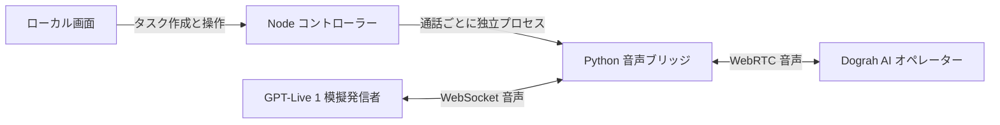

# Dograh Tantei

[English](README.md) · [简体中文](README.zh-CN.md) · [日本語](README.ja.md)

[Dograh の音声エージェント](https://github.com/dograh-hq/dograh)を、複数の通話で継続的に検証するローカルアプリです。GPT-Live 1 が**模擬発信者**を担当し、選択した **AI オペレーター**と実際の音声を交換します。Dograh の文字起こし、通話全体の録音、Gathered Context を確認し、Pi と Jev がそれぞれテスト目標の達成を判定します。内蔵 Pi でテスト条件の作成、結果分析、許可したワークフローのプロンプト修正を行えます。

React の画面、ローカルの Node コントローラー、Python 音声プロセスで構成されています。データベース、クラウドへのアプリ配置、マイクやスピーカーを使った音声の受け渡しは不要です。Dograh とモデル提供元へのネットワーク接続は必要です。

## インストールと起動

1. **ソースを入手します。** 受け取ったソース一式を展開するか、実際のリポジトリページに記載されたアドレスから clone してください。`package.json`、`README.md`、`.env.example` がある `dograh-tantei` ディレクトリに移動します。ダウンロードしたフォルダー名にバージョンなどが付いている場合は、実際の名前を使ってください。以下のコマンドはすべてプロジェクトのルートで実行します。
2. **実行環境を用意します。** Node.js **22.19 以降**と Python **3.12** を使用します。[uv](https://docs.astral.sh/uv/getting-started/installation/) があれば、音声環境のセットアップ時に Python 3.12 の `.venv` を作成します。uv を使わない場合は、`python3`（Windows では `python`）が Python 3.12 を指していることを確認してください。
3. **接続設定を置きます。** 同僚から `.env` を受け取っている場合は、`package.json` と同じ場所に置きます。既存の `.env` は内容を確認せずに上書きしないでください。設定がない場合は `.env.example` を `.env` にコピーし、下記の接続情報を記入します。
4. **インストール、確認、起動を行います。** エラーが出た場合は、解決してから次へ進んでください。

```sh
npm ci
npm run setup:audio
npm run doctor
npm start
```

ブラウザーで **http://127.0.0.1:4317** を開きます。`npm start` は画面をビルドしてからローカルサービスを起動します。起動しただけでは有料の通話は始まりません。`npm run doctor` はローカルの依存関係を確認するもので、アカウントの利用権限確認や実通話は行いません。

利用中はターミナルを開いたままにしてください。終了するときは、そのターミナルで **Ctrl+C** を押します。ブラウザーを閉じるだけではサービスや実行中のタスクは停止しません。次回は同じディレクトリで `npm start` を実行します。依存関係の再インストールは不要です。開発時は `npm run dev` を使います。

## 接続とモデルの API キー

`.env` の記入例です。

```dotenv
DOGRAH_BASE_URL=https://dograh.example.com/api/v1
DOGRAH_LOGIN_TOKEN=your_login_token
OPENAI_API_KEY=your_openai_key
PI_OPENAI_API_KEY=
PI_ANTHROPIC_API_KEY=
TYPESAFE_API_KEY=your_typesafe_key
```

| 設定                   | 用途                                                    |
| ---------------------- | ------------------------------------------------------- |
| `DOGRAH_BASE_URL`      | 利用する Dograh バックエンドの API ベース URL           |
| `DOGRAH_LOGIN_TOKEN`   | ログイン Cookie `dograh_auth_token` の値                |
| `OPENAI_API_KEY`       | GPT-Live 1 の通話、Pi の OpenAI 接続の既定キー          |
| `PI_OPENAI_API_KEY`    | Pi 専用の OpenAI キー。空欄なら `OPENAI_API_KEY` を使用 |
| `PI_ANTHROPIC_API_KEY` | Pi 用 Claude キー。OpenAI のキーとは独立                |
| `TYPESAFE_API_KEY`     | Jev のテスト判定用 TypeSafe API キー                    |

これらの接続設定は、**プロジェクトの `.env` → 起動時の環境変数 → ローカルに保存した設定**の順に優先します。`.env` に項目があれば、空欄も含めて起動環境の同名値を置き換えます。項目自体がなければ起動環境の値を使えます。空欄は保存済み設定を消去しません。Pi の OpenAI 専用キーが空欄の場合は、有効な `OPENAI_API_KEY` を使います。環境から読み込んだキーはサーバーのメモリー内だけで使用し、設定ファイルや Pi の認証ファイルへ転記しません。画面には設定元が表示されます。`.env` を変更したらアプリを再起動してください。

`.env` を使わず、接続設定の画面で入力することもできます。

1. **Dograh の URL とログイントークン。** `dograh_auth_token` の値を入力します。`Bearer` 接頭辞や単独の `dograh_auth_token=...` 形式も受け付けます。Cookie ヘッダー全体や cURL コマンドは貼り付けないでください。期限切れになったら再ログインして更新します。この認証はワークフローへのアクセス用で、Dograh 内の LLM、STT、TTS のキーとは別です。アプリはログイントークンを使用し、Dograh の API キーは必要ありません。ドメインのみの URL には `/api/v1` を補います。リバースプロキシで別のパスを使う場合は、完全な API ベース URL を指定します。接続確認ではワークフロー一覧を読み取ります。
2. **GPT-Live 1 用の OpenAI キー。** 模擬発信者は `gpt-live-1` を使用します。アカウントに Live API の利用権限と利用可能な枠が必要です。
3. **Pi の接続先とモデル。** Codex サブスクリプションでのログイン、OpenAI API キー、Claude API キーから選び、モデルを保存して有効にします。フォーム内の選択を変えるだけでは実際のモデルは切り替わりません。画面には現在有効な接続先とモデルが表示されます。既定値は OpenAI / Codex が `gpt-5.6-sol`、Claude が `claude-opus-5` です。保存済みの選択は維持します。

**Jev：** `TYPESAFE_API_KEY` を設定するか、接続設定の Jev 画面でキーを保存します。バックエンドが Pi とは別に TypeSafe API を直接呼び出します。Jev、Pi CLI、skill のインストールは不要です。

Codex の OAuth ログイン情報はこのインストール内に保存され、`.env` には含まれません。通話に必要な OpenAI API キーの代わりにはなりません。Pi が未接続でも、明確な秒数を指定した応答待ちの音響計測は可能です。任意の業務要件の整理と自動評価には Pi が必要です。

## 通話の仕組み



テスト条件を確認すると、タスクとワークフローの基準スナップショットを保存します。コントローラーが Dograh に `smallwebrtc` の実行記録を作成し、独立した Python プロセスを起動します。認証情報は標準入力のパイプで渡します。音声ブリッジが Live の WebSocket と Dograh の WebRTC を接続し、音声のリサンプリング、バッファリング、実時間での送信、録音を行います。

Dograh は自身のワークフローと STT・LLM・TTS 設定で処理するため、実際の音声処理経路を検証できます。各通話には個別の Live セッション、Dograh Run ID、音声プロセス、証拠ディレクトリがあります。10 並列でもブラウザーを 10 個開く必要はありません。

画面は React/Vite、ローカル制御は Node/Express、音声接続は `aiortc` と `websockets`、音声処理は PyAV/NumPy、Pi の実行には `@earendil-works/pi-coding-agent` を使用します。MCP や別途 Pi CLI を導入する必要はありません。[構成とコード案内](docs/architecture.md)も参照してください。

## テストを実行する

ワークフローを選択し、今回の要求を入力し、Pi でテスト条件を整理します。草案を確認・修正して、予算を設定してから開始します。既定の言語は日本語です。新規タスクの初期値は **10 通話**、**1 通話 600 秒**、**合計 100 分**です。例えば「発信者の発話が終わってから 10 秒を超えても応答がなければ記録する」と指定できます。

- **並列数の共有：** 初期値は全体で 10 通話。接続設定から 1〜30 通話に変更でき、各タスクで共有します。
- **通話一覧：** タスク詳細に常時表示します。進行中の通話、通話時間、Pi と Jev の個別判定を確認できます。緑のチェックは合格、赤いバツは不合格、疑問符は判定不能です。
- **通話詳細：** `#822` などの番号をクリックすると、目標、結果、Dograh の文字起こし、通話全体の録音、保存された Gathered Context を確認できます。
- **目標に沿った判定：** 最終目的地の確認では、Gathered Context の `dropoff_location` と会話内容を使用します。
- **ラウンド集約：** 集約欄の Pi 分析ボタンで、Pi の評価結果をまとめます。問題の横にある通話番号から詳細を開けます。Jev の判定は別表示で、Pi 集約の集計には含めません。
- **次のラウンド：** 同じ目標とテスト設定で新規タスクを作り、改めて通話します。前の結果は保持します。ボタンのツールチップで動作を確認できます。
- **停止：** 一時停止は新しい通話の割り当てを止め、即時停止は現在の接続を閉じます。接続エラー時は一時停止します。アプリ再起動時に通話は自動再開しません。ブラウザーを閉じてもタスクは停止しません。
- **予算：** 並列数、通話数、接続準備を含む通話時間、合計音声時間を制限します。進行中の通話は最大時間分を予約し、失敗・異常終了時は予約分を消費します。Pi、Jev、音声サービスはそれぞれのアカウントの利用枠を使用します。
- **タスク削除：** 完了または停止したタスクを確認後に削除し、対応する Pi 会話も消去します。他の会話には影響せず、録音ファイルは端末に残ります。通話や評価の実行中は終了を待ってください。

## Pi の役割と書き込み権限

GPT-Live 1 は模擬発信者です。Pi はテスト条件の作成、業務証拠の評価、運用者の分析支援を担当し、設定で選択した接続先とモデルで推論します。

テスト条件の整理では `/api/tasks/plan` がワークフローのプロンプトを読み、発信者への指示、チェック項目、応答待ち時間、解釈の説明を草案にします。この時点では Dograh の通話を作成しません。確認後に開始すると `/api/tasks` がタスクを保存し、スケジューラーが実行します。Pi 未接続時は要求を保持して明確な応答秒数だけ抽出し、業務チェック項目は生成しません。

Pi のチャットが使えるツールは `get_test_findings`、`get_call_evidence`、`read_workflow_prompts`、`preview_prompt_changes`、`apply_prompt_changes` の 5 つです。条件整理と自動評価は、チャット履歴を共有しない独立したツールなしのセッションを使います。シェルや汎用ファイル操作ツールは公開していません。

Pi が変更できるのは、対応するノードのプロンプト草稿のみです。そのチャットターンで、選択したワークフローへの編集許可が必要です。保存処理は関連タスクを一時停止し、現在の通話が終わるのを待ち、基準バージョンを確認し、バックアップを保存してから書き込み、再読込で検証します。ワークフローの公開は行いません。上流 API にアトミックなバージョンロックがないため、保存中は別のクライアントから同じワークフローを編集しないでください。

## Dograh の結果と Jev の判定

通話後に Dograh が保存した文字起こしと Gathered Context を読み取ります。通話詳細で Dograh の録音全体を再生できます。

TypeSafe キーを設定すると、Jev が元のテスト要求、Gathered Context、会話テキストを使って自動判定し、合格・不合格・判定不能を返します。モデルは `jev-latest` です。バックエンドがこれらの入力から `state` を作るため、手動の設定は不要です。Pi と Jev の判定は別々に保存します。

## タスクごとの Pi 会話

ワークベンチと各タスクは別々の Pi 会話を持ちます。タスクに戻ると以前の会話を続けられ、ワークベンチでは固有のコンテキストを使います。サーバー再起動後も保存したセッションを継続できますが、ページ再読込時に過去のメッセージ一覧を復元する機能はありません。

タスクを削除すると対応する Pi セッションも削除します。条件整理、自動評価、集約はサイドバーの履歴とは別の分析セッションで行います。

## ローカルデータと共有

既定のデータ保存先はソース外の **`~/.tantei/`** です。プロジェクト名を `dograh-tantei` に変更しても、保存先と **`TANTEI_*`** 環境変数は互換性のため維持します。既存の記録を移動・消去しません。

同僚は自分の接続情報を使うか、別途受け取った `.env` をプロジェクトに置いて利用できます。同じ `.env` を共有すると、対応する Dograh アカウントと API 利用枠も共有します。`.env` は Git の追跡対象外です。データディレクトリ全体には認証情報、録音、会話、ワークフローの内容があるため、配布しないでください。設定・認証ファイルは `0600`、ディレクトリは `0700` の権限を指定しますが、実際の保護は OS の権限機構に依存し、暗号化保管ではありません。

`TANTEI_DATA_DIR`、`TANTEI_PORT`、`TANTEI_PYTHON` で保存先、ポート、Python 実行ファイルを指定できます。これらの実行設定は、**起動環境の値を `.env` より優先**します。共有する `.env` には端末固有の絶対パスを含めないことを推奨します。サービスは `127.0.0.1` のみで待ち受け、Host、Origin、書き込み用のローカルトークンを確認します。

```sh
TANTEI_DATA_DIR="$PWD/.tantei" npm start
```

## 検証と現在の範囲

```sh
npm run typecheck
npm test
npm run build
npm run format:check
.venv/bin/python -m unittest audio_worker.test_worker -v
```

Windows の音声テストは `.venv\Scripts\python.exe -m unittest audio_worker.test_worker -v` で実行します。

音声の自動テストは、模擬 Live サービスと実際のローカル aiortc 対向を使い、有料通話は行いません。テスト合格は、すべての Dograh 環境、モデルアカウント、ネットワークでの動作保証ではありません。自身の環境では短い 1 通話から確認し、その後に並列数を増やしてください。

現在の画面は音声の回帰テストが中心です。Dograh のテキストセッション用アダプターは実装済みですが、独立したテキストタスクの画面はありません。Pi のチャット記録はローカルに保存しますが、ページ再読込時に以前のチャット画面を復元する機能はありません。

開発時には、任意でプロジェクトの `codebase-memory-mcp` 設定を使い、コードの索引作成と構造の検索を行えます。`npm run memory:index` で索引を作成し、`npm run memory:serve` で MCP サーバーを起動します。開発ツール向けの機能であり、音声テストには使わず、アプリの実行にも必須ではありません。[コード記憶ツールの設定](docs/codebase-memory.md)を参照してください。

詳細：[構成とコード案内](docs/architecture.md)、[Dograh 接続](docs/dograh-connection.md)、[Pi 統合](docs/pi-integration.md)、[音声プロセス](audio_worker/README.md)。
