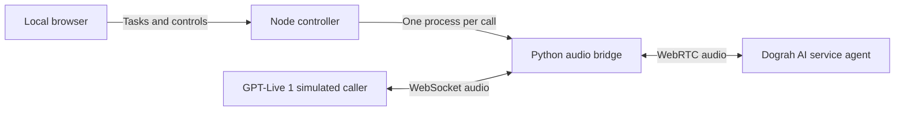

# Dograh Tantei — Voice Agent Testing Workbench

[English](README.md) · [简体中文](README.zh-CN.md) · [日本語](README.ja.md)

A local testing tool built specifically for [Dograh voice agents](https://github.com/dograh-hq/dograh). Run concurrent, repeatable calls to check whether your voice agent meets your test goals. GPT-Live 1 acts as the **simulated caller** and exchanges real audio with the selected **AI service agent**. Review Dograh transcripts, full recordings, and Gathered Context, with separate Pi and Jev judgments against your test goals. The embedded Pi assistant helps write tests, analyze feedback, and update authorized workflow drafts.

The application uses a React interface, a local Node controller, and Python audio workers. It needs no database, cloud deployment, microphone, or speaker loopback. Dograh and the model providers still require network access.

## Install and start

1. **Get the source.** Extract the supplied source archive, or clone the address shown on the project's actual repository page. Enter the `dograh-tantei` directory containing `package.json`, `README.md`, and `.env.example`. A downloaded directory may have a version suffix; use its actual name. Run all commands below from this project root.
2. **Prepare the runtimes.** Use Node.js **22.19+** and Python **3.12**. With [uv](https://docs.astral.sh/uv/getting-started/installation/) installed, the audio setup script creates `.venv` using Python 3.12. Without uv, first make sure `python3` (`python` on Windows) refers to Python 3.12.
3. **Add configuration.** If a colleague supplied a `.env`, put it beside `package.json`. Preserve an existing `.env`; do not overwrite it without checking its contents. Otherwise, copy `.env.example` to `.env` and fill in the connection details described below.
4. **Install, check, and launch.** Resolve any error before moving to the next command:

```sh
npm ci
npm run setup:audio
npm run doctor
npm start
```

Open **http://127.0.0.1:4317**. `npm start` builds the interface before starting the local service. Starting the application does not start paid calls. `npm run doctor` checks local dependencies; it does not verify provider access or make a test call.

Keep the terminal open while using the application. Press **Ctrl+C** there to stop it. Closing the browser does not stop the service or its tasks. On later visits, run `npm start` from the same directory; reinstalling dependencies is unnecessary. Use `npm run dev` for development.

## Connections and model keys

Example `.env`:

```dotenv
DOGRAH_BASE_URL=https://dograh.example.com/api/v1
DOGRAH_LOGIN_TOKEN=your_login_token
OPENAI_API_KEY=your_openai_key
PI_OPENAI_API_KEY=
PI_ANTHROPIC_API_KEY=
TYPESAFE_API_KEY=your_typesafe_key
```

| Setting                | Purpose                                                                    |
| ---------------------- | -------------------------------------------------------------------------- |
| `DOGRAH_BASE_URL`      | Your Dograh backend API base URL                                           |
| `DOGRAH_LOGIN_TOKEN`   | The value of the `dograh_auth_token` login cookie                          |
| `OPENAI_API_KEY`       | GPT-Live 1 calls, Pi's OpenAI fallback                                     |
| `PI_OPENAI_API_KEY`    | Optional separate OpenAI key for Pi; leave blank to reuse `OPENAI_API_KEY` |
| `PI_ANTHROPIC_API_KEY` | Separate Claude key for Pi; never uses the OpenAI key                      |
| `TYPESAFE_API_KEY`     | TypeSafe API key for Jev test judgments                                    |

For these connection fields, priority is **project `.env` → inherited environment → locally saved settings**. An explicitly present `.env` value, including an empty value, replaces the inherited environment value. Missing fields can use the inherited environment. Empty values leave locally saved settings available; an empty Pi OpenAI key falls back to the effective `OPENAI_API_KEY`. Environment-managed keys remain in server memory and are not copied to local settings or Pi's authentication file. The interface shows their configuration source. Restart after changing `.env`.

Alternatively, configure connections in the settings interface:

1. **Dograh URL and login token.** Supply the raw `dograh_auth_token` value. A `Bearer` prefix or a single `dograh_auth_token=...` assignment is accepted; do not paste a whole cookie header or cURL command. Renew the token after it expires. This connection accesses your workflows; it is separate from Dograh's LLM, STT, and TTS credentials. The app uses login-token authentication and does not require a Dograh API key. An origin-only URL gets `/api/v1` appended; provide the full API base for a custom reverse-proxy path. Connection verification reads the workflow list.
2. **GPT-Live 1 OpenAI key.** The simulated caller uses `gpt-live-1`. Your account needs Live API access and available quota.
3. **Pi provider and model.** Choose Codex subscription login, an OpenAI API key, or a Claude API key, then save and activate the model. Changing the form selection alone does not change the active model; the interface shows what is actually in use. OpenAI and Codex default to `gpt-5.6-sol`; Claude defaults to `claude-opus-5`. Existing saved provider/model choices are preserved.

**Jev:** set `TYPESAFE_API_KEY` or save your key under Connections and Settings → Jev. The backend calls TypeSafe directly, separately from Pi. No Jev installation, Pi CLI, or skill is required.

Codex OAuth is local to this installation and is not included in `.env`. It cannot replace the OpenAI API key required for voice calls. Without Pi, explicit response-time requirements can still use acoustic timing; compiling and automatically evaluating arbitrary business requirements needs Pi.

## How calls work



After you confirm a test plan, the controller saves the task and workflow baseline. It creates a Dograh `smallwebrtc` run and starts a separate Python worker, passing credentials through standard input. The worker connects the Live WebSocket to Dograh WebRTC, resamples and paces audio, and saves both tracks, a mix, and timestamped events.

Dograh uses its own workflow and STT/LLM/TTS configuration, so calls exercise its actual voice pipeline. Each call has its own Live session, Dograh Run ID, worker, and evidence directory. Ten concurrent calls do not require ten browser tabs.

The main components are React/Vite for the interface, Node/Express for local control, `aiortc` and `websockets` for audio transport, PyAV/NumPy for audio processing, and `@earendil-works/pi-coding-agent` for Pi. There is no MCP dependency or separate Pi CLI requirement. See [architecture and code navigation](docs/architecture.md).

## Run a test

Select a workflow, describe this round's requirement, ask Pi to prepare the test conditions, review or edit the draft, set budgets, and start. The default language is Japanese. New tasks default to **10 calls**, **600 seconds per call**, and **100 voice minutes**. For example: “Record a problem if the agent remains silent for more than 10 seconds after the caller finishes.”

- **Shared concurrency:** ten slots by default, adjustable from 1 to 30 in Connections and Settings. Tasks share the pool.
- **Call list:** always visible in task details, showing active calls, duration, and separate Pi and Jev results. Green checks mean pass, red crosses mean fail, and question marks mean inconclusive.
- **Call details:** click a call number such as `#822` to see the goal, result, Dograh transcript, full recording, and saved Gathered Context.
- **Goal-based judgments:** a final-destination check uses `dropoff_location` in Gathered Context together with the conversation text.
- **Round summary:** use the Pi analysis button inside the round-summary section to summarize Pi reviews. Click the call numbers beside findings to open their details. Jev results remain separate and are not included in Pi summary metrics.
- **New round:** creates a new task using the existing goal and test settings, making new calls while retaining the previous round. The button tooltip explains this behavior.
- **Controls:** pause stops scheduling new calls; immediate stop closes current connections. Connection errors pause the task. Restarting the app does not resume calls automatically. Closing the browser does not stop tasks.
- **Budgets:** each task limits concurrency, call count, per-call duration including setup, and voice minutes. Active calls reserve their maximum duration; failed or interrupted calls consume that reservation. Pi, Jev, and voice services use their respective account quotas.
- **Delete task:** completed or stopped tasks can be deleted after confirmation, together with their Pi conversation. Other conversations are unaffected; recording files remain on disk. Wait for calls and reviews to finish before deleting.

## Pi's role and write permissions

GPT-Live 1 is the caller. Pi helps author the test, judge business evidence, and assist the operator; inference uses the provider/model selected in settings.

Preparing test conditions calls `/api/tasks/plan`, reads the selected workflow's prompts, and creates an editable draft of caller instructions, assertions, timing threshold, and interpretation. It does not create a Dograh call. Starting the confirmed task calls `/api/tasks`; the local scheduler runs it. Without Pi, planning preserves the original requirement and extracts an unambiguous response-time threshold, but creates no business assertions.

Pi chat has five domain tools: `get_test_findings`, `get_call_evidence`, `read_workflow_prompts`, `preview_prompt_changes`, and `apply_prompt_changes`. Planning and automatic evaluation use separate, tool-free sessions without access to the chat history or workflow writes. General shell and filesystem tools are not exposed.

Pi can save supported node-prompt fields only after the current chat turn has permission to edit the selected workflow draft. The write path pauses related tasks, waits for current calls, checks the baseline, saves backups, applies the change, and verifies it by reading it back. It does not publish workflows. The upstream API has no atomic version lock, so avoid simultaneous edits from another client during a save.

## Dograh results and Jev judgments

After a call, the application reads Dograh's saved transcript and Gathered Context. Call details provide playback of the complete Dograh recording.

With a TypeSafe key configured, Jev automatically judges the original test requirement against Gathered Context and the conversation text, returning pass, fail, or inconclusive. The backend calls `jev-latest` and builds its `state` from those inputs; no manual state setup is needed. Pi and Jev judgments are saved separately.

## Pi conversations across tasks

The workbench and each task have separate Pi conversations. Switching back to a task continues its previous conversation; the workbench uses its own context. Saved sessions can continue after a server restart, though refreshing the browser does not restore the earlier visible message list.

Deleting a task removes its Pi session too. Test planning, automatic review, and summaries use separate analysis sessions rather than the sidebar chat history.

## Local data and sharing

Data defaults to **`~/.tantei/`**, outside the source directory. The `dograh-tantei` rename preserves this path and all **`TANTEI_*`** variables; existing records are not moved or cleared.

Colleagues can use their own connections, or receive a `.env` separately and place it in their copy of the project before installation. Sharing it shares the corresponding Dograh account and provider quota. `.env` is Git-ignored. Do not distribute the entire data directory: it contains credentials, recordings, conversations, and workflow snapshots. Credential/settings files use mode `0600` and directories `0700`, subject to operating-system permissions; this is not encrypted storage.

`TANTEI_DATA_DIR`, `TANTEI_PORT`, and `TANTEI_PYTHON` customize the data path, port, and Python executable. These runtime settings retain **inherited environment priority over `.env`**. Omit machine-specific absolute paths from a shared `.env`. The service listens only on `127.0.0.1` and checks Host, Origin, and a local token for write requests.

```sh
TANTEI_DATA_DIR="$PWD/.tantei" npm start
```

## Verification and current limits

```sh
npm run typecheck
npm test
npm run build
npm run format:check
.venv/bin/python -m unittest audio_worker.test_worker -v
```

On Windows, use `.venv\Scripts\python.exe -m unittest audio_worker.test_worker -v` for the audio tests.

Automated audio tests use a simulated Live service and a real local aiortc peer, with no paid calls. Passing tests does not certify every Dograh deployment, provider account, or network. Start with one short call on your own deployment before increasing concurrency.

The current interface focuses on voice regression. A Dograh text-session adapter exists, but there is no separate text-task interface. Pi chat transcripts are saved locally, but refreshing the page does not restore the previous chat view.

For development, the optional project configuration for `codebase-memory-mcp` supports code indexing and structural queries. Run `npm run memory:index` to index the code and `npm run memory:serve` to start its MCP server. This serves development tools; it is not part of voice testing or required to run the application. See [codebase memory setup](docs/codebase-memory.md).

Further reading: [architecture](docs/architecture.md), [Dograh connection](docs/dograh-connection.md), [Pi integration](docs/pi-integration.md), [audio worker](audio_worker/README.md).
