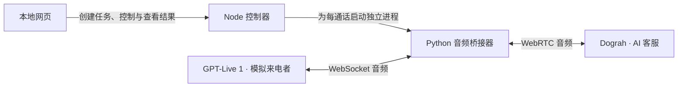

# Dograh Tantei

[English](README.md) · [简体中文](README.zh-CN.md) · [日本語](README.ja.md)

在本地浏览器管理并发语音测试。GPT-Live 1 扮演来电者，通过真实音频与 [Dograh voice agent](https://github.com/dograh-hq/dograh) 通话；使用 Dograh 保存的转写、完整录音和 Gathered Context 查看测试结果，由 Pi 与 Jev 分别判断是否达到测试目标。内置 Pi 也能协助迭代 Dograh Voice Agent。

React 界面 + 本机 Node 控制器 + Python 音频进程。无需数据库、云端部署或麦克风回放；浏览器只负责控制与试听。Dograh 与模型服务仍需要网络连接。

## 首次安装与启动

1. **取得项目并进入根目录。** 解压收到的源码包，或使用项目实际仓库页面提供的地址执行 `git clone`。进入 `dograh-tantei` 目录，确认里面有 `package.json`、`README.md` 和 `.env.example`。如果下载目录带版本后缀，以实际目录名为准。以下命令都在项目根目录执行，不需要另建服务器项目。
2. **准备运行环境。** 安装 Node.js **22.19+** 和 Python **3.12**。可使用 [uv](https://docs.astral.sh/uv/getting-started/installation/) 管理音频环境；有 uv 时，安装脚本会选择 Python 3.12 创建项目的 `.venv`。没有 uv 时，请先确认终端的 `python3`（Windows 为 `python`）是 Python 3.12。
3. **放入连接配置。** 如果已收到同事提供的 `.env`，把它放到项目根目录，与 `package.json` 同级。**已有 `.env` 时不要覆盖**，先确认要保留的配置。如果没有收到配置，将 `.env.example` 复制为 `.env`，按下方说明填写自己的连接信息。
4. **安装、检查并启动。** 在终端依次执行；某一步报错时，先解决报错再继续：

```sh
npm ci
npm run setup:audio
npm run doctor
npm start
```

启动成功后，在浏览器打开 **http://127.0.0.1:4317**。`npm start` 会先构建网页，再启动本地服务；它不会自动开始付费测试。`npm run doctor` 检查本机依赖，不验证模型账号权限或执行真实通话。

使用期间保持启动终端打开。退出时在该终端按 **Ctrl+C**；只关闭网页不会停止服务或正在运行的任务。下次使用时，回到同一项目目录执行 `npm start` 即可，不必重新安装依赖。开发时使用 `npm run dev`。

### 连接配置

`.env` 示例（已有可用配置时无需重新填写）：

```dotenv
DOGRAH_BASE_URL=https://dograh.example.com/api/v1
DOGRAH_LOGIN_TOKEN=你的登录Token
OPENAI_API_KEY=你的OpenAIKey
PI_OPENAI_API_KEY=
PI_ANTHROPIC_API_KEY=
TYPESAFE_API_KEY=你的TypeSafeKey
```

`OPENAI_API_KEY` 用于 GPT-Live 1 和 Pi 的 OpenAI 连接。`PI_OPENAI_API_KEY` 可留空，也可填入 Pi 专用 Key。Claude 使用单独的 `PI_ANTHROPIC_API_KEY`。OpenAI / Codex 默认模型为 `gpt-5.6-sol`，Claude 默认为 `claude-opus-5`；已保存的提供方和模型选择会保留。Codex 订阅登录仍可在界面选择，登录状态不会包含在 `.env` 中。

这些连接字段的优先级是 **项目 `.env` > 启动环境变量 > 本机已保存设置**。文件中显式填写的值（包括空值）会覆盖宿主环境，防止其他程序的同名 Key 串入；文件缺项才读取启动环境变量。空值不覆盖本机设置，Pi 的 OpenAI 专用 Key 留空时复用有效的 `OPENAI_API_KEY`；Claude 的 Key 独立配置。从环境加载的字段会显示配置来源，密钥仅在服务端读取；修改 `.env` 后重启应用。也可以不使用 `.env`，在「连接与设置」填入：

1. **Dograh 后端 API 地址及登录 Token**。粘贴登录后 `dograh_auth_token` 的值；也支持 `Bearer Token` 或单条 `dograh_auth_token=Token`。应用只使用 Token 认证，不需要 Dograh API Key。Token 过期后重新登录并更新。这里用于访问自己的 Dograh 工作流，与 LLM、STT、TTS 的模型密钥无关。域名根地址自动补 `/api/v1`；反向代理的子路径应填完整 API base URL。首次验证会读取工作流列表。
2. **GPT-Live 1 的 OpenAI API Key**。模拟来电固定使用 `gpt-live-1`，需要账号具有 Live API 权限和额度。
3. **Pi 连接**。选择 Codex 订阅、OpenAI API Key 或 Claude API Key，配置对应连接，选择模型后保存并启用。切换设置中的选项本身不会切换正在使用的模型，界面会显示实际启用的提供方与模型。登录凭证属于此安装实例；Codex 订阅登录不能替代 GPT-Live 1 所需的 OpenAI API Key。

`TYPESAFE_API_KEY` 用于 Jev 判断，也可在「连接与设置 → Jev」中保存。后端直接调用 TypeSafe API，无需安装 Jev、Pi CLI 或相关 skill。Jev 与 Pi 分别调用，不由 Pi 代调。

尚未连接 Pi 时，可使用明确的超时要求做声学计时测试；任意业务规则的解释与自动评审需要 Pi。界面会明确显示规则如何被理解，再启动付费通话。

## 实现原理

GPT-Live 1 是**模拟来电者**，Dograh 中选定的 voice agent 是被测的 **AI 客服**。本机 Python 进程充当音频桥接器，让双方直接交换数字音频；无需用扬声器对着麦克风，也无需自动操作 Dograh 网页。



一次通话按以下过程运行：

1. 用户确认测试条件后，本地控制器保存任务及工作流基线，调度器按并发和预算分配通话。
2. 控制器调用 Dograh API，为所选 workflow 创建 `smallwebrtc` 运行记录，取得独立的 Run ID。创建记录本身还没有建立音频连接。
3. 控制器启动一个 Python 进程，将来电者指令和该次连接配置通过进程输入管道传入。Python 一端连接 GPT-Live 1 的 WebSocket，另一端通过 Dograh 的信令 WebSocket 建立 WebRTC 音频连接。
4. 桥接器将 GPT-Live 1 生成的声音发送给 Dograh，再把 Dograh 返回的声音送回 GPT-Live 1，并处理采样率转换、音频缓冲和实时发送节奏。Dograh 按自己的工作流及 STT、LLM、TTS 配置处理来电，因此测试覆盖其实际语音处理链路。
5. 同时保存双方音轨、混音、事件和版本信息。回应等待由本地声学计时器检测；通话完成后的业务语义评审由 Pi 参与。

每通话都有独立的 GPT-Live 会话、Dograh Run、音频进程和结果目录。10 路并发对应 10 组连接，由本地调度器统一管理，不需要打开 10 个网页。

| 部分           | 使用的组件                            | 作用                                           |
| -------------- | ------------------------------------- | ---------------------------------------------- |
| 网页界面       | React、Vite                           | 配置连接、编写测试、控制任务、试听证据         |
| 本地服务       | Node.js、Express                      | 提供本地接口、对接 Dograh、推送进度            |
| 调度与结果管理 | 项目自行实现                          | 共享并发池、预算预留、停止与恢复、本地文件记录 |
| 音频连接       | Python、`aiortc`、`websockets`        | WebRTC 与 GPT-Live WebSocket 双向桥接          |
| 音频处理       | PyAV、NumPy                           | 重采样、PCM 处理、录音和声音活动检测           |
| 智能体运行     | `@earendil-works/pi-coding-agent` SDK | 模型连接、分析会话和受限的业务工具调用         |

应用运行不依赖 MCP。Pi 通过 SDK 注册的自定义工具调用本地功能；不需要额外安装 Pi CLI。实现入口：[本地接口与 Pi 工具](server/app.ts)、[调度器](server/scheduler.ts)、[通话执行器](server/runner.ts)、[音频桥接器](audio_worker/worker.py)。

## 一轮测试

选择工作流 → 输入本轮要求 → 用Pi整理测试条件 → 查看规则 → 设置预算 → 开始。默认语言为日语；新任务默认最多 **10 通**，单次上限 **600 秒**，总语音上限 **100 分钟**。例如「来电者说完后超过 10 秒仍然没有回应，记录问题」。

- 全局并发默认 10 路，在「连接与设置」调整为 1–30 路；各任务共享名额。
- 任务详情始终显示全部通话，包括进行中的通话、时长和结果。Pi 与 Jev 的判断分开展示：绿色勾表示通过，红色叉表示未通过，问号表示无法判定。
- 点击 `#822` 这样的通话编号，查看测试目标、测试结果、Dograh 转写、完整录音和「Dograh 保存的通话上下文」（Gathered Context）。
- 判断围绕原始测试要求。例如检查最终目的地时，使用 Gathered Context 中的 `dropoff_location`，并结合通话文本。
- 在「本轮汇总」点击「用 Pi 分析汇总」，汇总本轮 Pi 评审结果；问题右侧的通话编号可直接点击。Jev 的判断单独保留在结果列，不计入 Pi 汇总。
- 「开始新一轮」沿用原目标和测试设置创建新任务，重新拨打测试电话；上一轮结果保留。移入按钮可查看说明。
- 暂停停止安排新通话；立即结束关闭当前连接。连接失败自动暂停，应用重启不自动恢复通话。关闭网页不会停止任务。
- 每任务限制并发、次数、单通时长（含连接建立）和语音分钟数。正在进行的通话预留最长时长，失败或异常中断按完整预留额扣减。这是通话时长预算；Pi、Jev 和语音服务分别使用对应账号额度。
- 完成或停止的任务可通过「删除任务」删除，确认后同时清理对应 Pi 对话；其他任务和工作台对话不受影响。录音文件仍保留在本机。正在通话或评审时需先等待结束。

## Pi 的职责与当前能力

Pi 是内嵌的智能体运行组件，推理由你在设置中连接和选择的模型完成。**GPT-Live 1 负责扮演模拟来电者；Pi 负责整理测试、分析反馈和辅助修改。** Pi 能执行哪些操作，由本应用接给它的工具决定。

### 「用Pi整理测试条件」与「开始测试」

**Pi 已经参与测试任务的编写。** 连接 Pi 后，点击「用Pi整理测试条件」会调用 `/api/tasks/plan`：读取所选工作流的提示词，将用户要求整理成模拟来电者指令、业务检查项、回应超时阈值和测试说明。这一步生成可修改的草案，不创建 Dograh 通话。

用户确认并点击「开始测试」后，界面调用 `/api/tasks`，由本地程序保存任务并交给调度器运行。没有连接 Pi 时，「用Pi整理测试条件」使用本地回退逻辑：保留原始来电要求、提取明确的回应秒数，但不生成业务语义检查项。

### 已接入的功能

| 功能             | 当前行为                                                                                                         |
| ---------------- | ---------------------------------------------------------------------------------------------------------------- |
| 整理测试条件     | 通过界面按钮编写可审阅、可修改的测试草案                                                                         |
| 自动业务评审     | 对有业务检查项且证据可用的通话进行逐项分析；结果依赖文字与结构化证据，不等于 Pi 直接听过录音                     |
| 分析测试反馈     | 在聊天中读取任务、问题和通话证据，解释发现、比较案例、提出改进建议                                               |
| 读取与预览提示词 | 读取当前 workflow 的节点提示词，保留基线并生成修改前后对比                                                       |
| 保存提示词草稿   | 在本轮聊天获得指定 workflow 的修改授权后，暂停相关任务、等待当前通话结束、备份、检查版本、保存并读回验证；不发布 |

聊天会话当前接入五个工具：`get_test_findings`、`get_call_evidence`、`read_workflow_prompts`、`preview_prompt_changes`、`apply_prompt_changes`。整理条件和自动评审使用独立、无工具的分析会话，不共享右侧聊天历史，也不能顺带修改工作流。

Pi 对 Dograh 的写入范围限于受支持的节点提示词草稿，实际修改由本地工具检查授权、版本及字段范围。

实现入口：[Pi SDK 封装](server/pi.ts)、[条件整理与业务评审](server/intelligence.ts)、[工具注册与写入边界](server/app.ts)。

## Dograh 结果与 Jev 判断

通话结束后，应用读取 Dograh 的通话转写与 Gathered Context。详情中提供完整 Dograh 录音播放，直接查看服务端保存的通话结果。

配置 TypeSafe API Key 后，Jev 使用原始测试要求、Gathered Context 和通话文本自动判断，输出通过、未通过或无法判定。调用使用 `jev-latest`；请求中的 `state` 由后端从这些数据构造，用户不需要另行设置。Pi 的评审和 Jev 判断分别保存。

## Pi 对话与任务切换

工作台和每个测试任务各自保存 Pi 对话。切换任务后，Pi 继续该任务上次的对话；返回工作台时使用工作台自己的上下文。服务重启后可继续保存的会话，但刷新网页暂不恢复之前的聊天消息列表。

删除任务会同时删除对应 Pi 会话。整理测试条件、自动评审与汇总使用各自的分析会话，不混入右侧聊天历史。

## 本地数据与分享

默认数据在 `~/.tantei/`，不在仓库中。项目改名为 `dograh-tantei` 后，**数据目录和 `TANTEI_*` 变量仍保持兼容**，不会迁移或清空旧记录。

同事可以使用自己的连接，也可以直接使用你分享的 `.env`：取得源码、放入文件，再按上面的安装和启动步骤运行，无需在界面重新填写。使用相同 `.env` 会共用对应的 Dograh 账号及 API 额度；`.env` 已被 Git 忽略，请单独传给需要使用的人。不要分享整个数据目录，其中包含对话、录音、凭证和工作流快照。设置/凭证文件使用 `0600` 权限，目录使用 `0700`（受操作系统权限机制约束）；不是加密保险库。

可在 `.env` 或启动环境变量中通过 `TANTEI_DATA_DIR`、`TANTEI_PORT`、`TANTEI_PYTHON` 自定义；这些运行参数仍以启动环境变量为先。分享 `.env` 时建议不填写本机专用的绝对路径。环境密钥只在运行时使用，不复制到本机设置或 Pi 认证文件。服务仅监听 `127.0.0.1`，校验 Host、Origin 与写请求令牌。

```sh
TANTEI_DATA_DIR="$PWD/.tantei" npm start
```

## 验证与当前边界

```sh
npm run typecheck
npm test
npm run build
npm run format:check
.venv/bin/python -m unittest audio_worker.test_worker -v
```

Windows 的音频测试命令为 `.venv\Scripts\python.exe -m unittest audio_worker.test_worker -v`。

已实现真实 Live WebSocket / Dograh SmallWebRTC 桥接；自动测试使用模拟 Live 服务与真实 aiortc 对端。自动测试通过不代表任意部署、模型账号或网络条件都已验收。首次连接自己的部署时，先跑单路短通话验证兼容性，再提高并发。

第一版以语音回归为主。Dograh 文本会话适配器已实现，但独立文本任务界面尚未提供。Pi 聊天转录保存在本地，页面刷新不恢复旧聊天界面。上游 Dograh 提示词保存没有原子版本锁，保存期间请避免其他客户端同时编辑同一 workflow；本工具会检查基线和保存后的内容，但不能提供上游不存在的原子保证。

开发时可选用本项目配置的 `codebase-memory-mcp` 来索引与查询代码结构：`npm run memory:index` 建立索引，`npm run memory:serve` 启动 MCP 服务。它服务于开发工具，不参与语音测试，也不是应用运行依赖。配置与使用方式见[代码记忆工具](docs/codebase-memory.md)。

技术细节：[架构与代码导航](docs/architecture.md)、[Dograh 连接](docs/dograh-connection.md)、[Pi 接入](docs/pi-integration.md)、[音频进程](audio_worker/README.md)。
