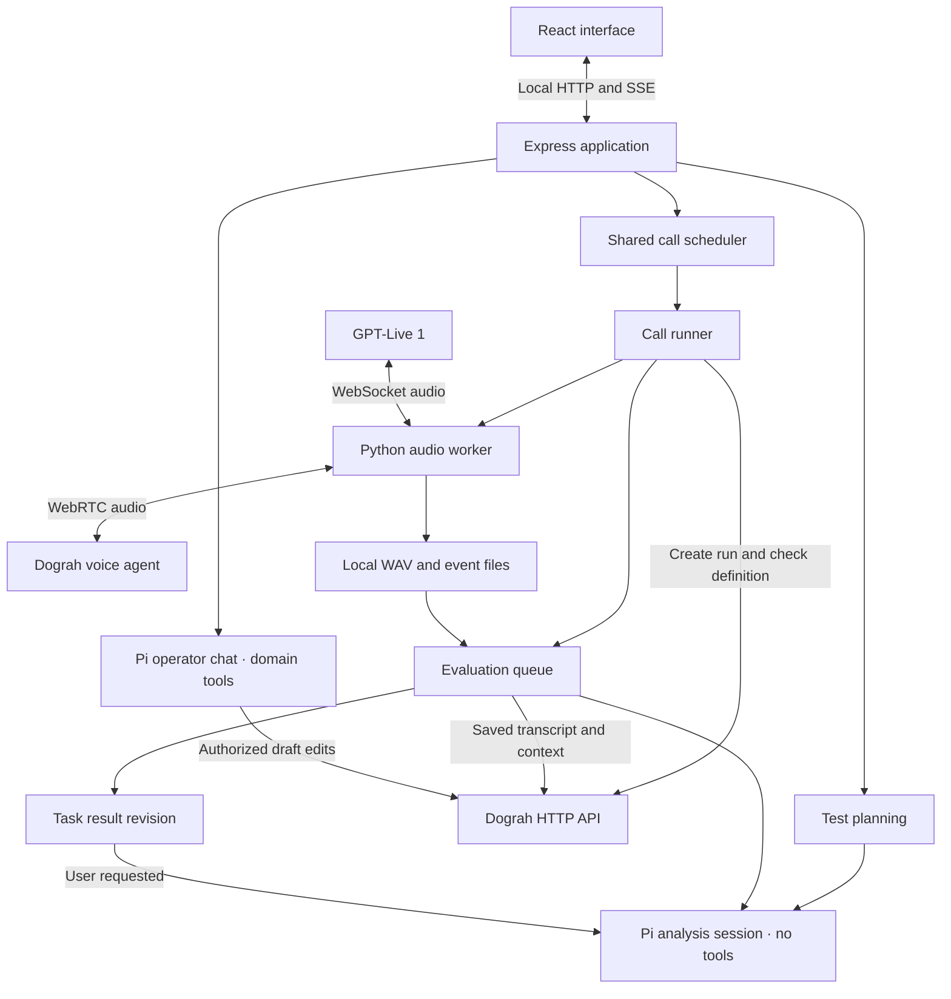

# Dograh Tantei architecture

Usage and installation: [English](../README.md) · [中文](../README.zh-CN.md) · [日本語](../README.ja.md).

Dograh Tantei is a local application with three execution layers: a browser interface, a Node controller, and one Python audio worker per call. JSON/JSONL files and WAV recordings provide persistence; there is no database. Dograh, GPT-Live 1, and the selected Pi provider remain external services.

## Runtime flow



The call scheduler shares a configurable pool across tasks: ten slots by default and a hard local setting limit of thirty. Each call reserves its maximum duration against that task's voice-minute budget, including connection setup. Evaluation has a separate queue with at most two active jobs; it does not hold a voice slot. Pi inference uses additional provider quota rather than the voice-minute reservation. Evaluation uses saved Dograh transcripts and Gathered Context.

## Frontend

| Module                                                                                              | Responsibility                                                                                                 |
| --------------------------------------------------------------------------------------------------- | -------------------------------------------------------------------------------------------------------------- |
| [`src/main.tsx`](../src/main.tsx)                                                                   | React entry point                                                                                              |
| [`src/App.tsx`](../src/App.tsx)                                                                     | Application shell, selected task, page and drawer state, top-level actions                                     |
| [`src/hooks/useWorkbench.ts`](../src/hooks/useWorkbench.ts)                                         | Local API/CSRF session, state refresh, SSE lifecycle, workflow loading, Pi streaming and authentication events |
| [`src/features/workbench/`](../src/features/workbench/)                                             | Card dashboard, shared capacity, task composer, task detail, grouped findings and call-result presentation     |
| [`src/hooks/useDialogFocus.ts`](../src/hooks/useDialogFocus.ts)                                     | Modal focus containment, focus restoration and background scroll locking                                       |
| [`src/features/settings/`](../src/features/settings/)                                               | Dograh/voice connection settings, Pi provider/model configuration, OAuth notifications                         |
| [`src/features/pi/PiPanel.tsx`](../src/features/pi/PiPanel.tsx)                                     | Operator chat and per-turn workflow-edit authorization                                                         |
| [`src/features/evidence/`](../src/features/evidence/)                                               | Dograh transcript, Gathered Context, evaluation summary and full-recording playback                            |
| [`src/features/findings/FindingPresentation.tsx`](../src/features/findings/FindingPresentation.tsx) | Finding categories, handling status and review presentation                                                    |
| [`src/components/ui.tsx`](../src/components/ui.tsx)                                                 | Shared interface primitives                                                                                    |
| [`src/lib/presentation.ts`](../src/lib/presentation.ts)                                             | Formatting and presentation helpers                                                                            |
| [`src/types.ts`](../src/types.ts)                                                                   | Browser-facing API, Pi, evidence and view types                                                                |
| [`src/styles.css`](../src/styles.css), [`src/styles/`](../src/styles/)                              | Stylesheet entry and styles grouped by interface area                                                          |

Settings use a dedicated full-width shell without the Pi chat sidebar. `SettingsView` owns category navigation and action feedback; Dograh, caller and runtime panels own their drafts, while `PiConnectionSettings` retains provider selection and OAuth state. Panels stay mounted across category switches. Each save submits only its category's draft with saved values for other settings; concurrency uses its dedicated endpoint. `CredentialField` renders environment sources without exposing secret values. `settings-layout.css` scopes the approved navigation layout and its mobile adaptation.

Shared persisted task, call, finding and settings types live in [`shared/types.ts`](../shared/types.ts). The frontend renders the backend's evidence and status; it does not decide whether model output is valid or authorize a remote write by itself.

## Backend

| Module                                                                                                 | Responsibility                                                                                               |
| ------------------------------------------------------------------------------------------------------ | ------------------------------------------------------------------------------------------------------------ |
| [`server/index.ts`](../server/index.ts)                                                                | Load environment configuration, bind loopback HTTP, serve Vite/static assets, handle shutdown                |
| [`server/app.ts`](../server/app.ts)                                                                    | API routes, SSE, input validation, local access checks, Pi domain tools, review/edit locks and authorization |
| [`server/call-routes.ts`](../server/call-routes.ts)                                                    | Call evidence, recording responses, re-review request locks and cancellation                                 |
| [`server/environment.ts`](../server/environment.ts)                                                    | Project `.env` precedence, configuration validation and public source flags                                  |
| [`server/connection.ts`](../server/connection.ts), [`server/dograh-auth.ts`](../server/dograh-auth.ts) | Credential normalization, server binding and connection fingerprints                                         |
| [`server/dograh.ts`](../server/dograh.ts)                                                              | Dograh protocol adapter, workflow snapshots, prompt-field extraction and guarded updates                     |
| [`server/store.ts`](../server/store.ts)                                                                | Local settings/state, serialized JSON writes, runtime-only environment overlays and restart recovery         |
| [`server/scheduler.ts`](../server/scheduler.ts)                                                        | Global slots, task budgets, reservations, pause/stop and completion accounting                               |
| [`server/runner.ts`](../server/runner.ts)                                                              | Workflow/run validation, child-process lifecycle, event ingestion, audio artifacts and evaluation handoff    |
| [`server/caller-instructions.ts`](../server/caller-instructions.ts)                                    | Construct the exact caller instructions used for a call                                                      |
| [`server/pi.ts`](../server/pi.ts)                                                                      | Embedded SDK, provider authentication, model choice, tool-scoped chat and independent analysis sessions      |
| [`server/intelligence.ts`](../server/intelligence.ts)                                                  | Stable planning/evaluation entry points; evaluation queue, cancellation, persistence and revision lifecycle  |
| [`server/test-planning.ts`](../server/test-planning.ts)                                                | Planning prompt/schema, explicit timing extraction and disconnected-Pi fallback                              |
| [`server/task-summary.ts`](../server/task-summary.ts)                                                  | Evidence-bound Pi task summaries, grouping validation and exact Run/finding membership                       |
| [`server/evaluation-evidence.ts`](../server/evaluation-evidence.ts)                                    | Transcript parsing, recording-time bounds, saved workflow context and prepared evidence                      |
| [`server/evaluation-judgment.ts`](../server/evaluation-judgment.ts)                                    | Judgment prompt/schema, evidence gates, categories, findings, summary and manual-review preservation         |
| [`server/numeric-evidence.ts`](../server/numeric-evidence.ts)                                          | Deterministic quantity-conflict detection between Live text and recording transcription                      |
| [`server/audio-review.ts`](../server/audio-review.ts)                                                  | Blind, separate transcription of saved caller and agent WAVs                                                 |
| [`server/audio-review-cache.ts`](../server/audio-review-cache.ts)                                      | Local validation of recording format, chunk coverage and hashes before cached review reuse                   |

The split evaluation modules keep model prompts and pure evidence/judgment logic separate from scheduling and file writes. `server/intelligence.ts` continues exporting the existing application interface, so callers do not need to know the internal module layout.

## Audio worker boundary

[`audio_worker/worker.py`](../audio_worker/worker.py) connects a pre-created Dograh `smallwebrtc` run to GPT-Live 1. The Node controller supplies one JSON configuration line through standard input, then keeps that pipe open for cancellation. Credentials do not appear in command-line arguments. Structured events return over standard output and are saved locally.

`aiortc` handles WebRTC, `websockets` handles Live and Dograh signaling, and PyAV/NumPy handle resampling and PCM. The worker sends the generated caller audio at a real-time pace and records audio actually consumed by the outgoing track, not simply audio generated by the model. It also saves received agent audio and a mix on the local recording timeline.

The acoustic monitor measures audible activity, not semantic correctness. A separate timer can report an unanswered deadline before any response arrives. Provider transcript timestamps, local event arrival times, and recording sample positions remain distinct. See the [audio worker protocol](../audio_worker/README.md) for event fields and transport details.

## Planning, judging and re-review

1. `/api/tasks/plan` reads the selected workflow and creates a reviewable plan through a tool-free Pi session. Planning does not start a call. Without Pi, only an unambiguous response-time limit is extracted; arbitrary business assertions remain unavailable.
2. `/api/tasks` validates the confirmed draft and budget, saves a baseline, and hands the task to the scheduler. The runner snapshots the workflow again for each call and checks the definition attached to the created run where supported.
3. A completed, eligible call enters evaluation independently of the audio slots. The evaluator loads that call's saved rules and workflow, excludes ineligible transcript events, and reads the saved Dograh transcript and Gathered Context through `server/dograh-evidence.ts`. Provider artifacts are fetched through bounded same-origin download endpoints without forwarding credentials; recording URLs remain server-side. Dograh WAVs are cached on playback, separately from local recordings.
4. Model output must match the judgment schema and cite real evidence. Scenario and audio-conflict checks can override an unsupported model verdict. Business outcomes, agent behavior, and observations remain separate; a failed objective does not itself prove inappropriate handling or backend failure.
5. `/api/calls/:id/review` can realign an eligible completed call's assertions to the original requirement. It locks the call from planning through persistence. It preserves the original caller instructions and recordings, uses Dograh evidence (or a validated existing audio-transcription cache for legacy calls without a Run ID), and never starts a new call or edits Dograh. Cancellation covers planning and evaluation. Failed attempts leave the previous report available.
6. `/api/tasks/:id/summary` runs only when requested. It gives Pi aggregate metrics and bounded finding clusters, then rejects any response that drops, duplicates, invents, or merges incompatible evidence IDs. The current report and every prior revision remain local. New call results or finding review changes mark the report stale until it is regenerated.

The evaluator writes its normalized result alongside the raw model judgment, evidence references and limitations. Findings remain reviewable candidates. A missing transcript, unavailable Dograh evidence or unavailable model is not a pass. The saved workflow establishes expected policy only; it cannot prove a tool call happened or establish its result.

## Local files

The default data root remains `~/.tantei/` for compatibility with existing installations. `TANTEI_DATA_DIR` can override it. The project rename does not migrate that directory or rename `TANTEI_*` settings.

```text
~/.tantei/
├── settings.json                 # Locally entered settings and credentials
├── state.json                    # Tasks, calls and current findings
├── tasks/<task-id>/baseline.json # Task's original workflow snapshot
├── tasks/<task-id>/summary.json  # Current user-requested Pi round summary
├── tasks/<task-id>/summary-revisions/<revision-id>.json
├── calls/<call-id>/
│   ├── metadata.json
│   ├── rules.json
│   ├── caller-instructions.json
│   ├── workflow.json
│   ├── workflow-after.json       # When obtained
│   ├── run-definition.json       # When definition validation is available
│   ├── dograh-run.json           # Server-only provider response
│   ├── dograh-evidence.json      # Normalized transcript, redacted context, recording availability
│   ├── dograh-mixed.wav          # Provider recording cached on playback; caller/agent likewise
│   ├── events.jsonl              # Worker event log
│   ├── bridge-events.jsonl       # Events received by the controller
│   ├── caller.wav / agent.wav / mixed.wav
│   ├── audio-review.json         # Optional full independent transcription
│   ├── audio-review-manual.json  # Optional sampled spot-check; not a full review
│   ├── evaluation.json
│   ├── evaluation-attempt.json
│   └── evaluation-revisions/<revision-id>/
├── edits/<edit-id>/              # Before/change/after workflow-edit audit
└── pi/                          # Isolated auth, selection, catalog and sessions
```

Files are created as their stages complete, so a failed call need not contain every artifact. Re-review revisions retain previous reports and findings. Manual review state is preserved only when the assertion and finding still match; earlier manual reviews remain in the revision record when objectives change.

`LocalStore` serializes JSON writes through temporary files and renames. On restart, running tasks pause, unfinished calls become interrupted, and unfinished evaluations become unavailable. Restart never silently resumes paid work. Source archives and Git should exclude `.env`, user data, recordings and Pi authentication.

## Credential and write boundaries

- The local service binds to `127.0.0.1`, checks Host/Origin and requires a local token for mutation requests. Browsers receive connection state and source flags, not stored API keys.
- Project `.env` takes precedence for the explicit connection fields, including blank values. Runtime options such as `TANTEI_PORT` retain inherited-environment priority. Environment keys overlay saved settings in memory and are not copied into persistent credential files.
- The caller uses the voice OpenAI key; automatic evaluation does not call the transcription API. Pi can use an explicit OpenAI fallback, a separate OpenAI key, a separate Anthropic key, or locally authenticated Codex OAuth. Codex OAuth does not authenticate Live calls.
- Pi's resource loader does not discover global skills, extensions or context files. Chat gets only the five registered domain tools; planning and evaluation get no tools. The SDK itself is not an operating-system sandbox: authorization and scope are checked in local tool implementations.
- Draft prompt updates require authorization for the selected workflow in the current chat turn. The app pauses related tasks, waits for calls, checks the retained baseline, backs up changes and verifies the saved result. It does not publish. Dograh's upstream API does not provide an atomic edit lock.

The optional [codebase-memory MCP setup](codebase-memory.md) is for development tools. It is separate from Pi's runtime tools and the voice-test execution path.

## Making changes

For interface work, start in the relevant `src/features/` area. Keep API/SSE lifecycle in `useWorkbench`, shared view types in `src/types.ts`, and presentation utilities in `src/lib/presentation.ts`. For evaluation changes, keep schema/prompt and evidence normalization in the domain modules; leave queueing, cancellation and report persistence in `intelligence.ts`.

Use `npm run format:check`, `npm run typecheck`, `npm test`, and `npm run build` for the Node/frontend code. Python audio changes also require `.venv/bin/python -m unittest audio_worker.test_worker -v` (use `.venv\Scripts\python.exe` on Windows). Browser checks should mock API routes before navigation when they only verify the interface, so an interaction cannot start a real call or modify an account accidentally.

Related documents: [Dograh adapter](dograh-connection.md), [Pi SDK integration](pi-integration.md), [design system](../DESIGN.md).

Dograh timestamps are retained relative to Run creation and are approximate playback locations, not local worker sample positions. Gathered Context supplies final values for matching test goals. Re-review preserves previous report revisions.

## Jev judgments

`server/jev.ts` independently compares the original task requirement with Dograh's saved transcript and Gathered Context through TypeSafe's `jev-latest` Choice API. It does not consume Pi's report or require extra order persistence evidence for a final-field test. The call list displays Pi and Jev results together. `TYPESAFE_API_KEY` can be supplied through the environment or saved in the Jev settings panel. Environment values take priority and are not copied into saved settings. Keys are never included in browser state or evaluation requests saved as evidence.

New completed, version-checked calls are evaluated when the key is configured. The local authenticated `POST /api/tasks/:id/jev-evaluate` endpoint evaluates existing eligible calls without dialing; equal input hashes reuse the saved result. Two requests run at most concurrently; requests are not retried automatically. Task stop and service shutdown cancel pending requests, and restart marks unfinished judgments unavailable. Provider results, probabilities, usage and exact request inputs are saved in `calls/<id>/jev-evaluation.json`; changed inputs preserve previous results under `jev-revisions/`. Pi findings and results are unchanged.
